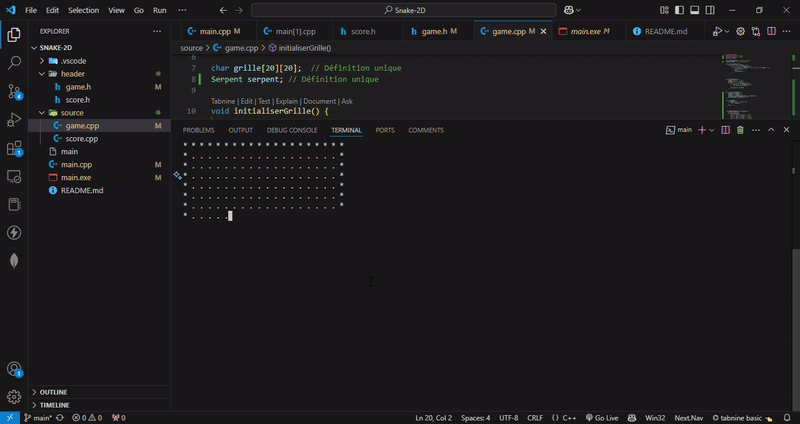
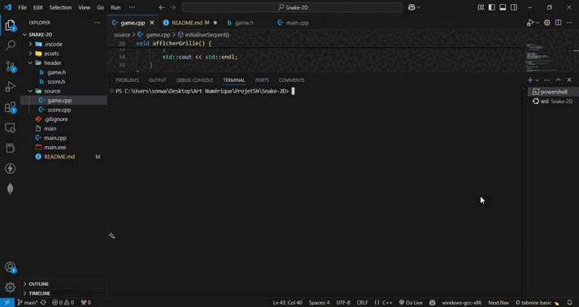

# Snake-2D

# Compiler sur ubuntu faire un :
* ```g++ -o main main.cpp source/*.cpp```
* ```./main```

# Compiler sur windows faire un :
* ```g++ -o main.exe main.cpp source/*.cpp```
* ```./main.exe```

# Prise en charge des couleurs ANSI (executer sur le terminale) :
* ```reg add "HKCU\Console" /v VirtualTerminalLevel /t REG_DWORD /d 1 /f```


# Démonstration
  